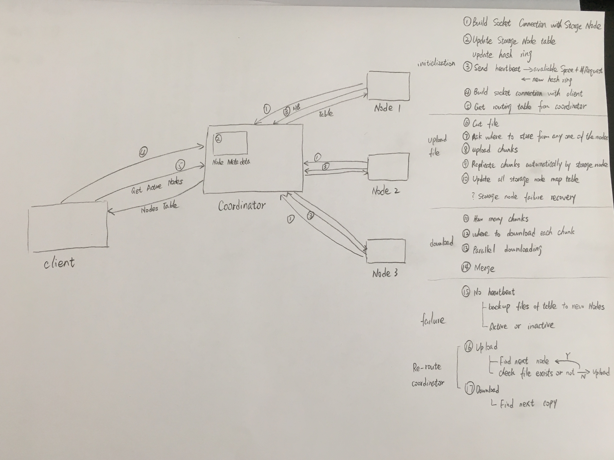

# P1
Project 1 - Distributed File System

This repository includes starter files and a sample directory structure. You are welcome to use it or come up with your own project structure.

Project Specification: https://www.cs.usfca.edu/~mmalensek/cs677/assignments/project-1.html

# Documentation

## Coordinator
  1. Add/Remove nodes:
     * can't: when the coordinator goes down
     * can:
       * hash ring re-arrange(add or remove proportion)
       * if remove(keep the id in a list, the next new node may take that id)
       * update the routing table

  2. Monitor the health of the cluster:
     * heartbeat and long connection socket
     * detect storage node failures:
       * a total of 3 duplicate chunks
       * a backup copy

  3. Coordinator recovery

  4. Routing table:

         * Node ID
         * position
         * hostname/ IP
         * status: active or inactive
         * free space available
         * the total number of requests processed

##  Storage Node
  1. Route client requests

  2. Store/Retrieve
     * update the routing table
     * update the all storage nodes map table(for loop all the nodes to maintain this table)
     * node info list itself

  3. Heartbeat with coordinator

     * update the routing table
     * messages in the storage node:

           * Store chunk [File name, Chunk Number, Chunk Data]
           * Get number of chunks [File name]
           * Get chunk location [File name, Chunk Number]
           * Retrieve chunk [File name, Chunk Number]
           * List chunks and file names [No input]
           * Get copy of current hash space [No input]

  4. Startup
     * a storage directory and the hostname/IP

## Client
  1. Break files

  2. Ask position

  3. Upload/Download(parallel)

  4. Pipeline fashion

  5. Get routing table from coordinator
     * a list of active nodes
     * the total disk space available in the cluster (in GB)
     * number of requests
     * a specific storage node(retrieve a list of files stored there)

### Design decisions
   * Protocols
     * Client/Storage node -------> Coordinator

         | Parameters         | Data Type     | Description                                               |
         | ------------------ |-------------  |:---------------------------------------------------------:|
         | client/storage node| string        | the request is from client or storage node                |
         | IP                 | string        | the IP address                                            |
         | function           | string        | such as adding node, removing node, asking info, heartbeat|

     * Client -------> Storage node

         | Parameters         | Data Type     | Description                                              |
         | ------------------ |-------------  |:--------------------------------------------------------:|
         | client             | string        | the request is from client                               |
         | IP                 | string        | the IP address                                           |
         | failure            | string        | the failure in the storage node                          |
         | function           | string        | such as asking position, storing, retrieving, asking info|

   * Chunk size: 128MB

     If we make the chunk size in a very small size, most of the data will spilt into many chunks. When we do the reading operation, it will spend a lot of time looking up the address of the chunks. Also this will let storage node RAM under a heavy load. If we make the chunk size in a large size, it takes more time when the storage node have to restart.

### Basic components flow
  * 
